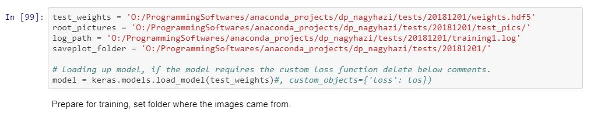
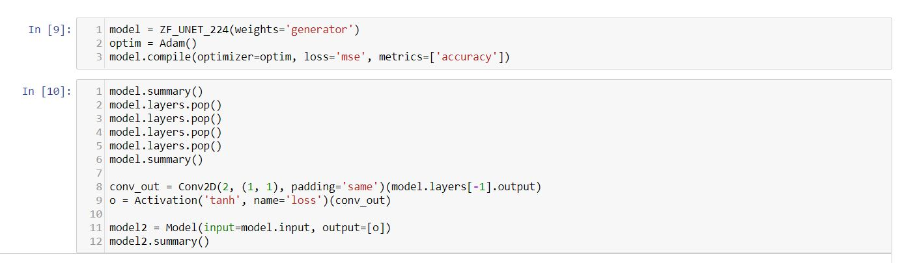
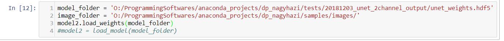

# Grayscaled pictures colorisation  

Homework for the 2018 BME VIK Deep learning course.

I choosed the IMG01 problem: Grayscaled image colorisation.
There is a sample folder with all the files my program will use up, just these samples smaller than their original sizes.
In this work i am using up the pretrained Keras VGG16 network for a part of my model.

## Prerequisites  
You can use up the requirements.txt to create your environment. (it contains a cpu tensorflow) Jupyter notebook  for the .ipynb files.  
Opencv2 for video colorization.  
NVIDIA GPU + CUDA cuDNN.  

## Getting Started

### Installation

- Clone this repository  
- Install Tensorflow and dependencies from https://www.tensorflow.org/install/
- If you want to use Google Open Image v4 pictures, then first you should download those:
  - [Human train labels](https://storage.googleapis.com/openimages/2018_04/train/train-annotations-human-imagelabels.csv)  
  - [Human valid labels](https://storage.googleapis.com/openimages/2018_04/validation/validation-annotations-human-imagelabels.csv)  
  - [Human test labels](https://storage.googleapis.com/openimages/2018_04/test/test-annotations-human-imagelabels.csv)  
  - [Image Ids and urls](https://storage.googleapis.com/openimages/2018_04/image_ids_and_rotation.csv)  
  - [Class descriptions](https://storage.googleapis.com/openimages/2018_04/class-descriptions.csv)  
- If you don't want to use Google images, then just use up some of your pictures. Separate them into train, valid, test folders.
- (Optional) Install python requirements:
    `pip install -r requirements.txt`
    
### Dataset preparation, collect images

You can prepare your dataset with the help of [data_collector.py](https://github.com/caspien6/deep_learning/blob/master/src/data_collector.py) and [Data Collection.ipynb](https://github.com/caspien6/deep_learning/blob/master/src/Data%20Collection.ipynb) files.
With them you can download pictures from Google Image v4 by label names: 
```
#Own .py file
import data_collector
from utility_methods import collect_and_separate_labels, collect_labels

data_hl = data_collector.DataCollector()

#This is a method which load up the required files for Google image into the memory. 
#You will need at least 8-10 Gigabyte memory space to perform this action
data_hl.load_datas(image_id_url_path, train_label_path, valid_label_path, test_label_path, class_description_path)

#Sample label names, you can choose names from the class description file
label_names = ['City', 'Cityscape', 'Town']

#This method will collect all 300kb Thumbnail image which label registered from the above label names.
#If you want to separate by label names into separate folders, then use collect_and_separate_labels method not collect_labels.
#This can be time consuming method.
collect_labels(data_hl, image_train_root_folder, label_names)
```
There is a commented section of data collecting part from my training script: [runner_stream.py](https://github.com/caspien6/deep_learning/blob/master/src/runner_stream.py), [runner_unet.py](https://github.com/caspien6/deep_learning/blob/master/src/runner_unet.py).

In the earier stage of the project i used a custom data loader class, there is a commented section how to use it in the [runner.py](https://github.com/caspien6/deep_learning/blob/master/src/runner.py)

### Training
To train one of my model, you need to run the some of the scripts: [runner_stream.py](https://github.com/caspien6/deep_learning/blob/master/src/runner_stream.py), [runner_unet.py](https://github.com/caspien6/deep_learning/blob/master/src/runner_unet.py). 

Before training you need to set some of the parameters inside the runner scripts. These are:
- pts_hull_file: Path to data/pts_hull_file.npy. This contains the discretized a,b pairs.
- distribution_file: Path to data/prior_probs.npy. This file is to customize loss function with color empirical distribution.
- image_<type>_root_folder where type can be train,valid,test: Path to the <type> folder.   
  

#### Hyperparameters for CLVGG-B (with customized loss function) and A (categorical cross entropy loss function) model (runner_stream.py) :
- for the weighted_categorical_crossentropy loss function lmb = 0.5  
- batch_size = 64
- from nnetwork.create_vgg_model(1,4), the parameters are : 
  - vgg_trainable_layer_count = 1, this is responsible for how many layers i want to train from behind the original VGG16.
  - upsampling = 4, this is for the upsampling layers, if you change it the output of the model size will change too.
- epochs = 200
- for the multithread feature: 
  - workers=6
  - max_queue_size = 12
  - early stopping patience=30
  
#### Hyperparameters for Unet model (runner_unet.py) :
- trainable layers for the original Unet model: -7
- early stopping patience=15
- epochs = 50
- for the multithread feature: 
  - workers=1
  - max_queue_size = 4
  
### Evaluate
The evaluations are also in the runner scripts in the end it will do it automatically.
If you want to visualize the colorization, there are notebooks where i implemented the methods for it:

#### CLVGG model colorization evaluation
The notebook is [Training.ipynb](https://github.com/caspien6/deep_learning/blob/master/src/Training.ipynb).  
You can download the A model weights: [a_weights.hdf5](https://drive.google.com/open?id=13MPUkLqiGiKOdWPuh1g2Q3FbM9rJ_yw4)  
You can download the B model weights: [b_weights.hdf5](https://drive.google.com/open?id=13MPUkLqiGiKOdWPuh1g2Q3FbM9rJ_yw4)  
Here is a figure from the notebook where you can set pretrained weights.  
  
In the figure above you need to setup 2 folder for displaying pictures:
- test_weights: Path for the trained weights
- root_pictures: Path where to save the created images.  
And 2 variable to setup the plot creation:
- log_path: Path to the training log file.
- saveplot_folder: Path to a folder where to save the plot.

After the 4 variable, you can decide whether or not use custom loss function.  
`model = keras.models.load_model(test_weights)#, custom_objects={'loss': los})`  
It is essential to comment out if you are using the b_weights!!!

#### Unet model colorization evaluation
The notebook is [U-net architecture.ipynb](https://github.com/caspien6/deep_learning/blob/master/src/U-net%20architecture.ipynb).  
Before setting weights you need to build up the model, like the figure did below.
You also need the basic pretrained weights (zf_unet_224) to be able to build up the network. You can download the weights from [here](https://drive.google.com/drive/u/0/folders/13MPUkLqiGiKOdWPuh1g2Q3FbM9rJ_yw4).  
After collecting the weights, build it up.  
  
After building up you can load up my trained weights (unet_weights), you can download those from [here](https://drive.google.com/drive/u/0/folders/13MPUkLqiGiKOdWPuh1g2Q3FbM9rJ_yw4)
Here is a section from notebook where you can set pretrained weights.  
  
The variables:
- model_folder: path to the weights file
- image_folder: path to the folder where you want to pictures  
  
## Results
